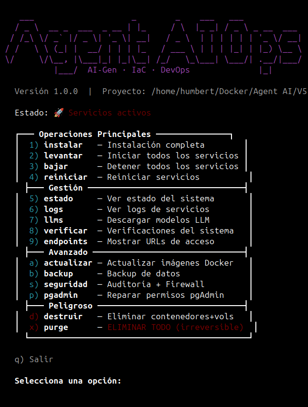

<div align="center">


[](https://docs.docker.com/compose/)
[](https://developer.nvidia.com/cuda-toolkit)
[](https://ollama.com/)
[](https://n8n.io/)
[](https://prometheus.io/)
[](https://grafana.com/)
[](https://www.gnu.org/software/bash/)
[](LICENSE)

*Infraestructura de IA Self-Hosted, diseñada y desarrollada bajo el enfoque DevOps e IaC.*

</div>


---


## Descripción general

**AI Lab Workplace** es un prototipo de plataforma de IA de nivel productivo y Self-Hosted, diseñada para ejecutar modelos de lenguaje grande (LLM), búsqueda vectorial y automatización inteligente íntegramente sobre hardware propio — sin dependencias de nube, sin cuotas de uso y con soberanía total sobre los datos.

Orquestada mediante un único archivo declarativo `docker-compose.yml` y gestionada por una CLI personalizada `agentai-ops.sh`, la plataforma levanta 15 servicios en contenedores que cubren todo el ciclo de trabajo con IA: desde la inferencia de modelos y el almacenamiento vectorial, hasta la automatización de flujos de trabajo y la observabilidad de la GPU en tiempo real.


---


## Estructura del proyecto

```
agent-ai-ops/
├── agentai-ops.sh          # CLI de infraestructura — punto de entrada único
├── docker-compose.yml      # Definición de orquestación de 15 servicios
├── .env                    # Variables de entorno y secretos (ignorado por git)
│
├── monitoring/
│   └── prometheus.yml      # Configuración de scrape para todos los exporters
│
├── n8n-data/               # Flujos de trabajo, credenciales y PDFs de n8n
├── ollama-data/            # Pesos de los modelos LLM descargados
├── qdrant-data/            # Almacenamiento del índice vectorial
├── postgres-data/          # Archivos de datos de PostgreSQL
├── redis-data/             # Persistencia AOF de Redis
├── grafana-data/           # Dashboards y plugins de Grafana (volumen nombrado)
└── prometheus-data/        # TSDB de Prometheus (volumen nombrado)
```


---


## Arquitectura

<p align="center">
  
</p>


---


## CLI

<p align="center">
  
</p>


---


## Operations CLI

Todo el ciclo de vida de la infraestructura se gestiona a través de un único script con menú interactivo TUI o comandos directos.

```bash
# Menú interactivo (recomendado)
bash agentai-ops.sh

# Comandos directos
bash agentai-ops.sh instalar     # Instalación completa (toolkit NVIDIA, directorios, configuración)
bash agentai-ops.sh levantar     # Iniciar todos los servicios
bash agentai-ops.sh bajar        # Detener todos los servicios
bash agentai-ops.sh reiniciar    # Reiniciar (todos o un servicio específico)
bash agentai-ops.sh estado       # Panel de estado del sistema
bash agentai-ops.sh logs         # Transmitir logs (todos o un servicio específico)
bash agentai-ops.sh llms         # Descargar modelos LLM en Ollama
bash agentai-ops.sh verificar    # Ejecutar health checks en todos los servicios
bash agentai-ops.sh endpoints    # Mostrar todas las URLs de los servicios
bash agentai-ops.sh actualizar   # Descargar las últimas imágenes Docker
bash agentai-ops.sh backup       # Archivar todos los volúmenes de datos
bash agentai-ops.sh seguridad    # Configurar firewall UFW + ejecutar auditoría Lynis
bash agentai-ops.sh destruir     # Eliminar contenedores y volúmenes
bash agentai-ops.sh purge        # ⚠️ Borrado total (irreversible)
```


---


## Inicio rápido


### Requisitos previos

- Host Linux (Ubuntu 22.04+ recomendado)
- GPU NVIDIA con drivers instalados
- Docker Engine + Docker Compose v2
- `curl`, `bash` ≥ 5.0


### 1 — Clonar y configurar

```bash
git clone https://github.com/Daniel-Humberto/AI-Lab-Workplace.git
cd agent-ai-ops
cp .env.example .env
# Editar .env — definir contraseñas e IDs de dispositivo GPU
```


### 2 — Instalar y levantar

```bash
# Instalación automatizada completa (toolkit NVIDIA, estructura de directorios, archivos de configuración)
sudo bash agentai-ops.sh instalar

# Iniciar los 15 servicios
bash agentai-ops.sh levantar

# Descargar el primer modelo LLM
bash agentai-ops.sh llms
```


### 3 — Acceso a los servicios

| Interfaz | URL | Notas |
|---|---|---|
| **n8n** Automatización | `http://HOST:5678` | Por defecto: `Admin` / definido en `.env` |
| **Open WebUI** | `http://HOST:8088` | Chat con LLMs locales |
| **Grafana** | `http://HOST:3000` | Por defecto: `admin` / definido en `.env` |
| **Prometheus** | `http://HOST:9090` | Explorador de métricas en bruto |
| **pgAdmin** | `http://HOST:5050` | Administración de base de datos |
| **RedisInsight** | `http://HOST:5540` | Visualización de caché |
| **Qdrant** | `http://HOST:6333` | Panel de la base de datos vectorial |


---


## Seguridad

La plataforma está diseñada con un enfoque de **defensa en profundidad** a nivel de red y host.

**Aislamiento de red** — Los servicios están segregados en dos redes Docker. Los servicios internos (bases de datos, exporters) quedan aislados en `agent-ai-network-internal` con `internal: true`, bloqueando cualquier acceso externo directo. Solo los servicios con interfaz de usuario se conectan a la red externa.

**Firewall UFW** — La configuración automatizada del firewall restringe todos los puertos de servicio a la subred LAN local (`192.168.1.0/24`). El tráfico externo queda denegado por defecto.

```bash
# Aplicar reglas de firewall + ejecutar auditoría de seguridad
bash agentai-ops.sh seguridad
```

**Auditoría con Lynis** — El comando `seguridad` instala y ejecuta [Lynis](https://cisofy.com/lynis/), una herramienta de hardening y auditoría de cumplimiento, generando un informe completo de seguridad del host en `/var/log/lynis-report.dat`.

**Secretos en variables de entorno** — Todas las contraseñas y credenciales se almacenan exclusivamente en `.env` (nunca commiteado) y se inyectan en tiempo de ejecución del contenedor. Ninguna credencial aparece en las capas de imagen ni en las definiciones de Compose.


---


## 📝 Licencia

Este proyecto está licenciado bajo la [Licencia GNU GPL v3](LICENSE).


---


<p align="center">
  <sub>© 2026 Ing. Daniel Humberto Reyes Rocha.</sub>
</p>


---
